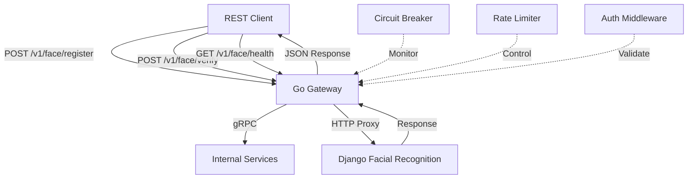

# 🚀 Facial Recognition gRPC-REST Gateway Integration

This document describes the facial recognition microservice integration that acts as a gateway between REST clients and a Django-based facial recognition service.

## 📋 Overview

The Go gRPC-REST Gateway service provides:
- **REST API endpoints** for facial recognition operations
- **gRPC service implementation** for internal microservice communication
- **Proxy functionality** to Django facial recognition service
- **Authentication and rate limiting** middleware
- **Circuit breaker pattern** for resilience
- **Comprehensive error handling** and logging

## 🎯 Features

### Core Functionality
- ✅ **Face Registration**: Register user faces with duplicate detection
- ✅ **Face Verification**: Verify user identity against registered faces
- ✅ **Health Checks**: Monitor service availability
- ✅ **Multipart File Upload**: Handle image uploads efficiently
- ✅ **Circuit Breaker**: Automatic failover when Django service is down
- ✅ **Retry Logic**: Exponential backoff for failed requests
- ✅ **Security Headers**: CORS, security headers, and rate limiting

### Technical Features
- ✅ **gRPC to REST Gateway**: Automatic REST endpoint generation
- ✅ **Protocol Buffers**: Type-safe service definitions
- ✅ **Connection Pooling**: Efficient HTTP client management
- ✅ **Request Validation**: Comprehensive input validation
- ✅ **Error Mapping**: gRPC errors to HTTP status codes
- ✅ **Monitoring Ready**: Prometheus metrics endpoints
- ✅ **Production Ready**: Docker containers and health checks

## 🏗️ Architecture



## 📡 API Endpoints

### 1. Face Registration
**Endpoint**: `POST /v1/face/register`

**Request** (multipart/form-data):
```bash
curl -X POST "http://localhost:8080/v1/face/register" \
  -F "user_id=john_doe" \
  -F "face_id=primary" \
  -F "allow_duplicates=false" \
  -F "duplicate_threshold=0.85" \
  -F "image=@john_face.jpg"
```

**Response**:
```json
{
  "success": true,
  "face_id": "primary",
  "message": "Face registered successfully",
  "num_faces_detected": 1,
  "duplicate_details": {
    "is_duplicate": false,
    "threshold": 0.85,
    "total_matches": 0,
    "message": "No duplicates found",
    "primary_match": null,
    "all_matches": []
  }
}
```

### 2. Face Verification
**Endpoint**: `POST /v1/face/verify`

**Request** (multipart/form-data):
```bash
curl -X POST "http://localhost:8080/v1/face/verify" \
  -F "user_id=john_doe" \
  -F "threshold=0.7" \
  -F "image=@verify_face.jpg"
```

**Response**:
```json
{
  "success": true,
  "verified": true,
  "confidence": 0.92,
  "matched_face_id": "primary",
  "threshold": 0.7,
  "distance": 0.08,
  "message": "Face verified successfully"
}
```

### 3. Health Check
**Endpoint**: `GET /v1/face/health`

**Response**:
```json
{
  "healthy": true,
  "message": "Service is healthy",
  "service_version": "1.0.0",
  "timestamp": 1703123456
}
```

## 🚀 Getting Started

### Prerequisites
- Go 1.21+
- Docker & Docker Compose
- Protocol Buffers compiler (`protoc`)
- Make

### 1. Environment Setup
Create or update your `app.env` file:
```bash
# AI Service (includes facial recognition)
AI_SERVICE_URL=http://facial-recognition-service:8000

# Authentication
JWT_SECRET=your-jwt-secret-key
TOKEN_SYMMETRIC_KEY=n4MRwVnITxIHLNiTLiuNKwodarP5zWqw

# Database
DB_HOST=localhost
DB_PORT=5432
DB_USER=postgres
DB_PASSWORD=password
DB_NAME=lazervault_go_db

# Ports
HTTP_SERVER_PORT=8080
GRPC_SERVER_PORT=9090
```

### 2. Generate Protocol Buffers
```bash
make proto
```

### 3. Build and Run with Docker Compose
```bash
# Build and start all services
docker-compose -f docker-compose.facial-recognition.yml up --build

# Or run in background
docker-compose -f docker-compose.facial-recognition.yml up -d --build
```

### 4. Run Locally (Development)
```bash
# Start dependencies
docker-compose -f docker-compose.facial-recognition.yml up postgres redis facial-recognition-service

# Run the Go service
go run main.go
```

## 🧪 Testing

### Manual Testing with cURL

**Register a face:**
```bash
curl -X POST "http://localhost:8080/v1/face/register" \
  -H "Authorization: Bearer YOUR_JWT_TOKEN" \
  -F "user_id=test_user_123" \
  -F "face_id=primary_face" \
  -F "allow_duplicates=false" \
  -F "duplicate_threshold=0.85" \
  -F "image=@test_face.jpg"
```

**Verify a face:**
```bash
curl -X POST "http://localhost:8080/v1/face/verify" \
  -H "Authorization: Bearer YOUR_JWT_TOKEN" \
  -F "user_id=test_user_123" \
  -F "threshold=0.7" \
  -F "image=@verify_test.jpg"
```

**Health check:**
```bash
curl -X GET "http://localhost:8080/v1/face/health"
```

### Load Testing
```bash
# Install hey for load testing
go install github.com/rakyll/hey@latest

# Test registration endpoint
hey -n 100 -c 10 -m POST \
  -H "Content-Type: multipart/form-data" \
  -D test_data.jpg \
  http://localhost:8080/v1/face/register
```

## 🔒 Security

### Authentication
- **JWT Tokens**: Bearer token authentication
- **API Keys**: X-API-Key header support
- **Rate Limiting**: Configurable request limits per IP

### Security Headers
- `X-Content-Type-Options: nosniff`
- `X-Frame-Options: DENY`
- `X-XSS-Protection: 1; mode=block`
- `Strict-Transport-Security`
- `Content-Security-Policy`

### File Upload Security
- **File Type Validation**: Only image files allowed
- **Size Limits**: 32MB maximum file size
- **Content-Type Verification**: MIME type checking

## 📊 Monitoring & Observability

### Health Checks
- **Service Health**: `/v1/face/health`
- **Django Service**: Proxied health check
- **Docker Health**: Container health monitoring

### Metrics (Future Implementation)
- Request count by endpoint
- Response time percentiles
- Error rates by type
- Image processing duration
- Circuit breaker state
- Authentication failures

### Logging
- Structured logging with levels
- Request/response logging
- Error tracking with stack traces
- Performance metrics

## 🛠️ Configuration

### Environment Variables
| Variable | Description | Default |
|----------|-------------|---------|
| `AI_SERVICE_URL` | AI service URL (includes facial recognition) | `http://facial-recognition-service:8000` |
| `JWT_SECRET` | JWT signing secret | Required |
| `HTTP_SERVER_PORT` | REST API port | `8080` |
| `GRPC_SERVER_PORT` | gRPC service port | `9090` |
| `LOG_LEVEL` | Logging level | `info` |

### Service Configuration
```go
// Circuit breaker settings
maxRetries: 3
retryDelay: 2s
circuitBreakerTimeout: 30s

// HTTP client settings
timeout: 30s
maxIdleConns: 10
idleConnTimeout: 30s

// File upload limits
maxFileSize: 32MB
allowedTypes: ["image/jpeg", "image/png", "image/jpg"]
```

## 🐛 Troubleshooting

### Common Issues

**1. Django Service Connection Errors**
```bash
# Check if Django service is running
curl http://localhost:8000/api/health

# Check Docker network
docker network ls
docker network inspect facial-recognition-network
```

**2. Protocol Buffer Generation Errors**
```bash
# Regenerate proto files
make proto

# Check protoc installation
protoc --version
```

**3. Authentication Failures**
```bash
# Verify JWT token
curl -H "Authorization: Bearer YOUR_TOKEN" http://localhost:8080/v1/face/health

# Check token configuration
echo $JWT_SECRET
```

### Debug Mode
Set environment variable for detailed logging:
```bash
export LOG_LEVEL=debug
export ENV=development
```

## 🚀 Deployment

### Production Deployment
1. **Build Docker Image**:
   ```bash
   docker build -f Dockerfile.facial-recognition -t facial-recognition-gateway:latest .
   ```

2. **Environment Configuration**:
   - Set production JWT secrets
   - Configure service URLs
   - Enable HTTPS
   - Set up monitoring

3. **Kubernetes Deployment** (Optional):
   ```yaml
   apiVersion: apps/v1
   kind: Deployment
   metadata:
     name: facial-recognition-gateway
   spec:
     replicas: 3
     selector:
       matchLabels:
         app: facial-recognition-gateway
     template:
       metadata:
         labels:
           app: facial-recognition-gateway
       spec:
         containers:
         - name: gateway
           image: facial-recognition-gateway:latest
           ports:
           - containerPort: 8080
           - containerPort: 9090
           env:
                       - name: AI_SERVICE_URL
              value: "http://facial-recognition-service:8000"
   ```

## 📚 Additional Resources

### Documentation
- [gRPC Gateway Documentation](https://grpc-ecosystem.github.io/grpc-gateway/)
- [Protocol Buffers Guide](https://developers.google.com/protocol-buffers)
- [Go Context Package](https://golang.org/pkg/context/)

### Related Services
- Django Facial Recognition Service (external)
- Authentication Service (`/pb/auth.proto`)
- User Management Service (`/pb/user.proto`)

## 🤝 Contributing

1. Fork the repository
2. Create a feature branch
3. Add tests for new functionality
4. Update documentation
5. Submit a pull request

## 📄 License

This project is part of the Lazervault ecosystem and follows the project's licensing terms.

---

**🎯 Ready to get started?** Follow the setup instructions above and test the endpoints with your Django facial recognition service! 